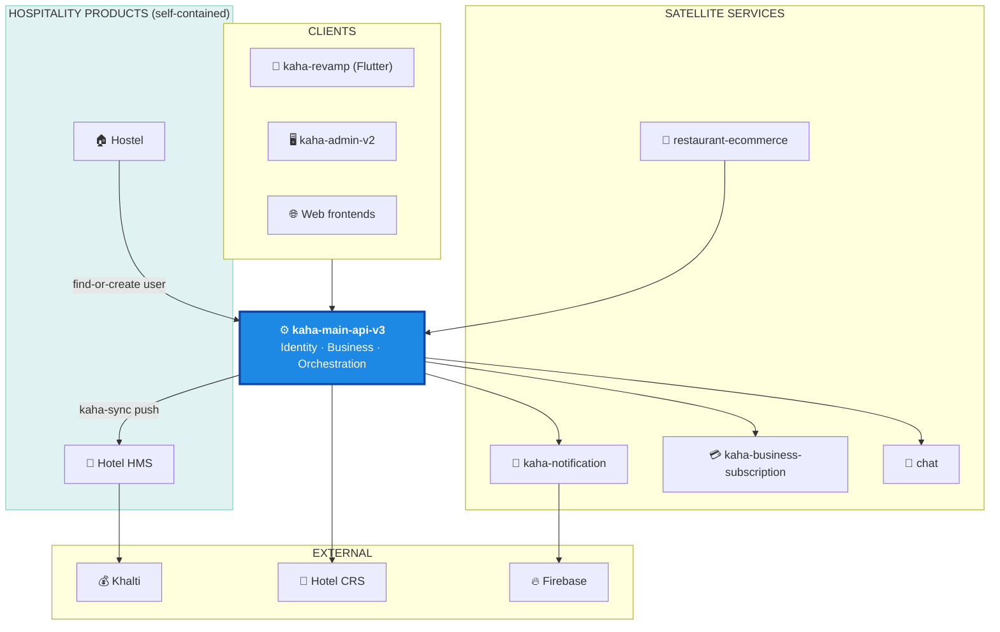

# Kaha Platform — Engineering Handover

> ℹ️ **This is the Confluence landing page.** Everything else is a child page. Start here.
>
> **Author:** esor111 · **Date:** May 2026 · **Audience:** Junior & Senior Engineers
> **Document standard:** C4 model + arc42 + ADRs. Every diagram has a prose description (works even if Mermaid doesn't render).

---

## 1. What This System Is

Kaha is a **Nepal-focused platform**: a business directory + identity backbone, with satellite services for notifications, billing, e-commerce, and chat, plus two self-contained hospitality products (Hotel HMS, Hostel) that integrate into it.

The architecture is **central backbone + satellite microservices**. One service (`kaha-main-api-v3`) owns identity and business data. Every other service either calls it or is called by it. No two services share a database.

> ⚠️ **The backbone is a deliberate single point of failure.** If `kaha-main-api-v3` is down, the platform is down. This is the accepted trade-off for one source of truth — see [`kaha-platform/service-architecture.md`](kaha-platform/service-architecture.md).

---

## 2. System Map



**In words:** clients hit the backbone. The backbone calls notification/subscription/chat/CRS outward; e-commerce calls the backbone inward to validate users/businesses. Hotel is **provisioned by** the backbone (inbound `kaha-sync`); Hostel **calls** the backbone to resolve contact users by phone. Notification fans out to Firebase; Hotel takes payments via Khalti.

---

## 3. Confluence Page Tree

Import this structure as the page hierarchy:

```
Kaha Platform — Engineering Handover  (this page)
├── Glossary
├── Onboarding (Day 1 / Week 1)
├── Service Architecture & Integration
├── Services
│   ├── kaha-main-api-v3
│   │   ├── Overview · Architecture · Data Model · Decisions · Runbook
│   ├── kaha-notification
│   │   ├── Overview · Architecture · Data Model · Decisions · Runbook
│   ├── kaha-business-subscription
│   │   ├── Overview · Architecture · Data Model · Decisions · Runbook
│   └── restaurant-ecommerce
│       ├── Overview · Architecture · Data Model · Decisions · Runbook
└── Hospitality Products
    ├── Hotel HMS
    │   ├── Overview · Architecture · Data Model · Decisions · Runbook
    └── Hostel
        ├── Overview · Architecture · Data Model · Decisions · Runbook
```

| File path | Confluence page |
|---|---|
| [`GLOSSARY.md`](GLOSSARY.md) | Glossary |
| [`onboarding.md`](onboarding.md) | Onboarding |
| [`kaha-platform/service-architecture.md`](kaha-platform/service-architecture.md) | Service Architecture & Integration |
| `kaha-platform/kaha-main-api/*.md` | kaha-main-api-v3 (5 pages) |
| `kaha-platform/kaha-notification/*.md` | kaha-notification (5 pages) |
| `kaha-platform/kaha-subscription/*.md` | kaha-business-subscription (5 pages) |
| `kaha-platform/kaha-ecommerce/*.md` | restaurant-ecommerce (5 pages) |
| `hotel/*.md` | Hotel HMS (5 pages) |
| `hostel/*.md` | Hostel (5 pages) |

Each service folder has the identical 5 pages: **overview · architecture · data-model · decisions · runbook**.

---

## 4. Repository Directory

| Repo | Local path | Role | Status |
|---|---|---|---|
| `kaha-app/kaha-main-api-v3` (private) | `D:/shared-code/code/kaha-main-api-v3` | Backbone | 🟢 Live |
| `kaha-app/kaha-notification` (private) | `…/notifications-projects/kaha-notification` | Satellite | 🟢 Live |
| `kaha-app/kaha-business-subscription` (private) | `…/kaha-business-subscription/kaha-business-subscription` | Satellite | 🟢 Live |
| `esor111/restaurant-ecommerce` | `…/own-organize/arju/restaurant-ecommerce` | Satellite | 🟢 Live |
| `kaha-app/hotel-backend` (private) | `…/hotel/hms-api` | Hotel backend | 🟢 Live |
| `esor111/hotel-world-frontend` | `…/hotel/hms-frontend` | Hotel guest FE | 🟢 Live |
| `esor111/hotel-admin` | `…/hotel/hms-admin` | Hotel admin | 🟢 Live |
| `esor111/property-site` | `…/hotel/property-site` | Hotel site (Next.js) | 🟢 Live |
| `esor111/the-real-hostel-server` | `…/oh-hostel/hostel-server/hostel-world-class-backend` | Hostel backend | 🟢 Live |
| `esor111/frontend-hostel-world` | `…/frontend-world-hostel/new-hostel-management-system` | Hostel FE | 🟢 Live |
| `esor111/individual-hostel-web` | `…/oh-hostel/hostel-site` | Hostel public site | 🟢 Live |
| `kaha-app/kaha-revamp` (private) | `…/mobile-app-flutter/kaha-revamp` | Flutter app | 🟡 Not yet documented |
| chat (`the-real-chat`/`chat-v4`) | `…/the-real-chat` | Chat satellite | 🟡 Not yet documented |
| `kaha-app/kaha-admin-v2` (private) | `…/refine-subscription/kaha-admin-v2` | Admin panel | 🟡 Not yet documented |
| `kaha-app/pharma`, `attendance-new`, `ems` | GitHub only | Standalone | ⚪ Out of scope (excluded) |

> Legacy/superseded repos (`notification-poc`, `notification-engine`, `hostel-ladger-*`, `hostel-new-server`, `world-class-hostel`, old hostel iterations) are intentionally **not documented** — they are replaced by the live repos above. Documenting them would mislead.

---

## 5. Tech Stack at a Glance

| Layer | Technology |
|---|---|
| Backend | NestJS (TypeScript) — every backend |
| Database | PostgreSQL; PostGIS on backbone + notification |
| Cache / Queue | Redis; BullMQ (notification) |
| Files | AWS S3 |
| Push | Firebase Cloud Messaging |
| Payments | Khalti (Nepal) |
| Mobile | Flutter |
| Frontend | React + Vite / Next.js |
| Containers | Docker + docker-compose |
| Logs | Loki + Grafana (notification) |

---

## 6. Where To Start

| You are… | Read in this order |
|---|---|
| **Anyone, first day** | This page → [Glossary](GLOSSARY.md) → [Onboarding](onboarding.md) |
| **Backend engineer** | [Service Architecture](kaha-platform/service-architecture.md) → [kaha-main-api overview](kaha-platform/kaha-main-api/overview.md) → its decisions/data-model |
| **On notifications** | [kaha-notification overview](kaha-platform/kaha-notification/overview.md) → architecture → decisions |
| **On billing** | [kaha-subscription overview](kaha-platform/kaha-subscription/overview.md) → data-model → decisions |
| **On e-commerce** | [restaurant-ecommerce overview](kaha-platform/kaha-ecommerce/overview.md) → data-model |
| **On hotel** | [Hotel overview](hotel/overview.md) → architecture → decisions |
| **On hostel** | [Hostel overview](hostel/overview.md) → architecture → decisions |

Full role-based path with first tasks: [onboarding.md](onboarding.md).
