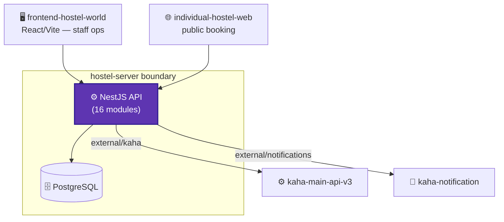
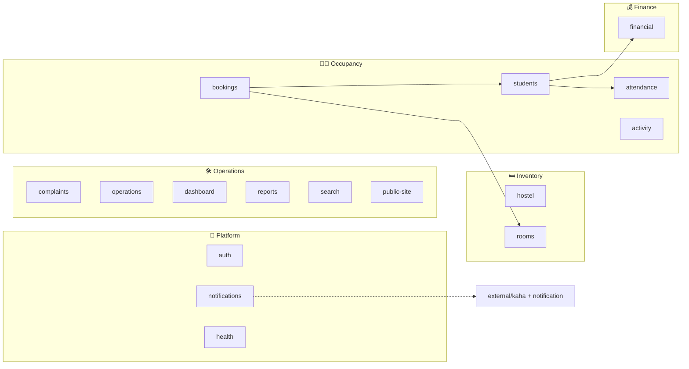
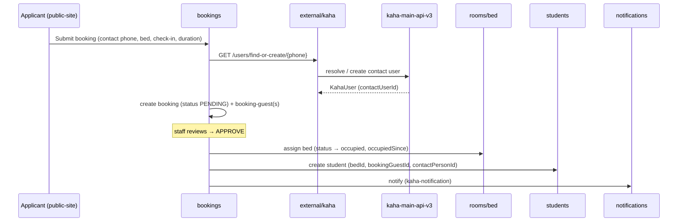

# Hostel System — Architecture (Building Blocks)

> ℹ️ **Confluence page placement:** child of *Hostel System → Overview*.
>
> **Document standard:** arc42 §5 + C4 Level 2/3 + key runtime flow.

---

## 1. Container View (C4 — Level 2)

External integrations are isolated in an `src/external/` module (`kaha`, `notifications`) — a clean seam: all outbound platform calls live in one place.

---

## 2. Component View (C4 — Level 3): Modules

| Module | Responsibility |
|---|---|
| `hostel` | Tenant root — hostel profile, subdomain, story, legal info |
| `rooms` | Rooms + their beds; gender, status, layout, category |
| `bookings` | Booking request → bed assignment → becomes a student |
| `students` | Resident lifecycle; links to bed, booking-guest, contact person |
| `attendance` | Daily attendance (`firstCheckIn`/`lastCheckOut`) |
| `financial` | Invoices, ledger, payments, charges, discounts, fee types |
| `complaints` | Complaint logging + resolution |
| `operations` | Day-to-day ops (housekeeping, transfers) |
| `dashboard` / `reports` | Occupancy, revenue, attendance analytics |
| `search` | Bed/room availability search |
| `public-site` | Public booking endpoints |
| `auth` | HMS-style local auth |
| `notifications` | Wraps `external/notifications` → kaha-notification |
| `health` | Health/readiness probes |

---

## 3. Key Runtime Flow: Public Booking → Student

**In words:** a booking carries contact details and target bed(s). The contact person is resolved in kaha-main by phone (`find-or-create`) so the platform has one identity for them. On staff approval, the bed flips to occupied and a `student` record is created linking bed + booking-guest + contact person. Notifications go out via the external seam.

---

## 4. Where To Go Next

- The bed/student/ledger tables → [data-model.md](data-model.md)
- Why bed-level / external seam → [decisions.md](decisions.md)
