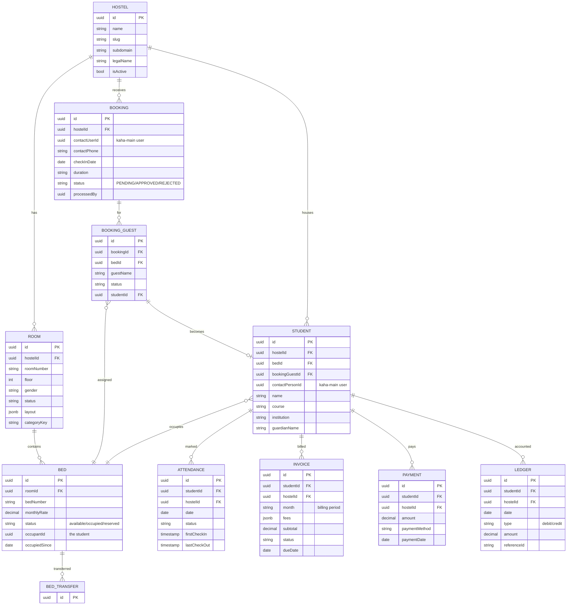

# Hostel System — Data Model

> ℹ️ **Confluence page placement:** child of *Hostel System → Overview*.
>
> **Document standard:** arc42 §8 + ER model. Code-verified from `hostel-world-class-backend/src` entities.

---

## 1. Core ER Diagram

**In words (read this even if the diagram renders):**
**HOSTEL** is the tenant root. It has **ROOM**s; each room **contains BED**s — the **bed is the atomic bookable unit** (`monthlyRate`, `status`, `occupantId`, `occupiedSince`).

A **BOOKING** is a request tied to a kaha-main contact user (`contactUserId`, resolved by phone). It has **BOOKING_GUEST**(s), each targeting a specific **BED**; on approval a guest **becomes a STUDENT**.

A **STUDENT** is the long-stay resident, linked to their `bedId`, originating `bookingGuestId`, and `contactPersonId` (kaha-main). Students accrue **ATTENDANCE** (daily, with check-in/out times), monthly **INVOICE**s (`month`, `fees` jsonb), **PAYMENT**s, and a running **LEDGER** (debit/credit with `referenceId` back to the source doc). **BED_TRANSFER** records bed moves.

> ℹ️ **The financial spine is `INVOICE` + `LEDGER` + `PAYMENT`.** Invoice = what's owed for a period; payment = money received; ledger = the running per-student account that ties them together. Reconciliation reads the ledger.

---

## 2. Conventions

| Convention | Detail |
|---|---|
| **Tenant key** | `hostelId` on every core table — isolation boundary |
| **Booking unit** | `BED` — never book a room directly |
| **Money** | `decimal` with TypeORM numeric transformer (string↔number) |
| **External identity** | `contactUserId` / `contactPersonId` reference kaha-main users (by phone find-or-create) |
| **Billing period** | `INVOICE.month` — monthly recurring, not transactional |

---

## 3. Data Decisions

- **Bed as atomic unit** — occupancy, pricing, transfers all hang off `BED`. A room is just a grouping; modeling beds directly is what makes dormitory occupancy correct (ADR-HO01).
- **Booking-guest as the bridge** — `BOOKING_GUEST` decouples "who applied" from "who became a resident", and carries the bed target before a `STUDENT` exists (ADR-HO02).
- **Ledger separate from invoice/payment** — a per-student running account (debits/credits with `referenceId`) gives an auditable financial truth independent of any single invoice or payment (ADR-HO03).
- **Contact identity delegated to kaha-main** — `find-or-create by phone` means the platform owns one identity for the contact person; the hostel only stores the reference.

---

## 4. Where To Go Next

- Modules operating this → [architecture.md](architecture.md)
- Why bed-level / ledger split → [decisions.md](decisions.md)
