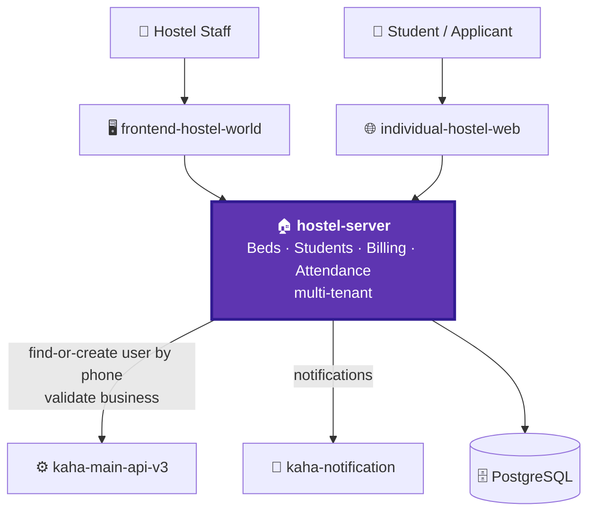

# Hostel System — Overview & Context

> ℹ️ **Confluence page placement:** child of *Kaha Platform → Hostel*. Parent of the other hostel pages.
>
> **Document standard:** arc42 §1–3 + C4 Level 1. **Priority: High.**

| | |
|---|---|
| **Backend** | `esor111/the-real-hostel-server` — `…/oh-hostel/hostel-server/hostel-world-class-backend` — NestJS |
| **Management frontend** | `esor111/frontend-hostel-world` — `…/frontend-world-hostel/new-hostel-management-system` — React/Vite |
| **Public website** | `esor111/individual-hostel-web` — `…/oh-hostel/hostel-site` |
| **Stack** | NestJS · PostgreSQL · TypeORM |
| **Multi-tenancy** | Every record scoped by `hostelId` |

---

## 1. Introduction & Goals

A **bed-level accommodation system** for student/long-stay hostels — distinct from the hotel HMS in booking unit (bed, not room), occupant model (resident students), and billing (monthly, not per-night).

| Goal | Why it exists |
|---|---|
| **Bed inventory** | Floor → Room → Bed; book at the *bed* level |
| **Student lifecycle** | Long-stay residents — onboarding, attendance, exit |
| **Monthly billing** | Invoices, ledger, fees, discounts — recurring, not transactional |
| **Operations** | Attendance, complaints, activities, dashboards |
| **Kaha integration** | Find-or-create the contact user in kaha-main by phone; notify via kaha-notification |

---

## 2. Constraints

| Constraint | Implication |
|---|---|
| **Multi-tenant by `hostelId`** | Every query must be hostel-scoped (same risk class as HMS ADR-H01) |
| **Bed is the atomic unit** | Availability/occupancy logic operates on beds, not rooms |
| **Monthly accounting** | Invoice/ledger are period-based; financial integrity matters |
| **Kaha lookups by phone** | Contact users are resolved via `find-or-create` against kaha-main |

---

## 3. Hotel vs Hostel — the essential distinction

| Aspect | Hotel (HMS) | Hostel |
|---|---|---|
| Booking unit | Room | **Bed** (within a room) |
| Occupant | Short-stay guest | **Student / long-stay resident** |
| Billing | Per-night, Khalti | **Monthly invoice + ledger** |
| Signature features | Rate plans, revenue mgmt | **Attendance, student mgmt** |
| Tenant key | `propertyId` | `hostelId` |

> ℹ️ They look similar but are **different domains** — do not assume HMS patterns transfer. Bed-level + monthly-ledger is the mental model here.

---

## 4. System Context (C4 — Level 1)

**In words:** staff use the management frontend; applicants use the public site. The backend calls `kaha-main-api-v3` to resolve the contact person (`/users/find-or-create/:phone`) and validate a business, and `kaha-notification` for outbound messages. Its own PostgreSQL holds all hostel data.

---

## 5. Where To Go Next

| You want to… | Read |
|---|---|
| Modules + the bed/booking model | [architecture.md](architecture.md) |
| The data model | [data-model.md](data-model.md) |
| Why bed-level / monthly-ledger | [decisions.md](decisions.md) |
| Run / operate it | [runbook.md](runbook.md) |
