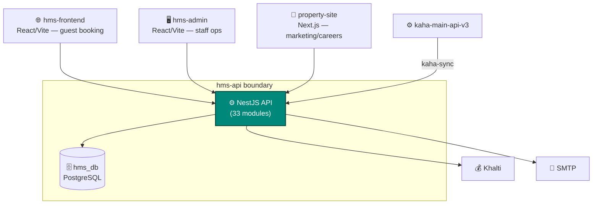
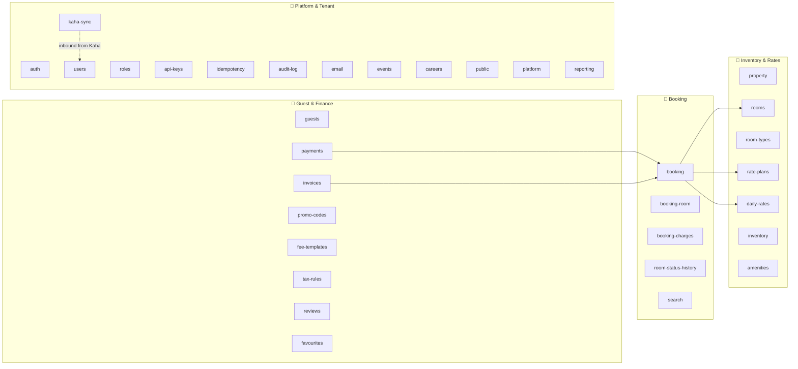
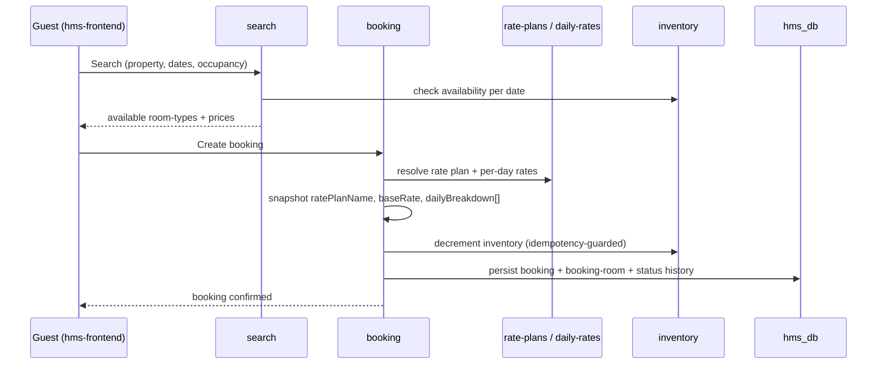
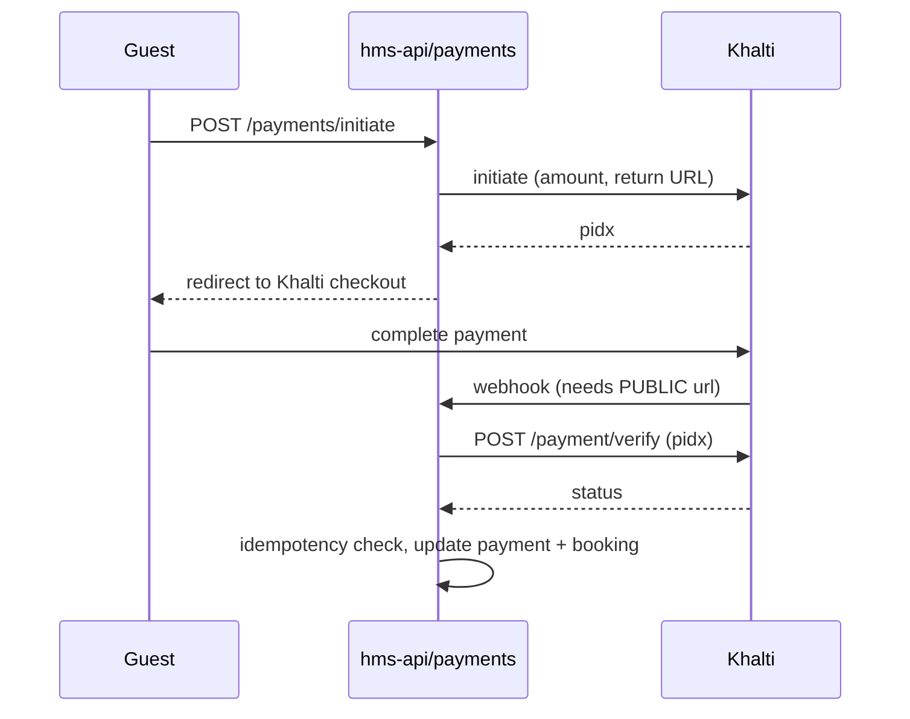

# Hotel System (HMS) — Architecture (Building Blocks)

> ℹ️ **Confluence page placement:** child of *Hotel System → Overview*.
>
> **Document standard:** arc42 §5 + C4 Level 2/3 + key runtime flows.

---

## 1. Container View (C4 — Level 2)

| Container | Role |
|---|---|
| `hms-frontend` | Guest-facing: search, book, pay |
| `hms-admin` | Staff-facing: front desk, housekeeping, rates, reports |
| `property-site` | Public marketing + careers (Next.js, partly static) |
| `hms-api` | The system of record — all 33 modules, one DB |

---

## 2. Component View (C4 — Level 3): Module Groups

> ℹ️ **Navigation tip:** a "double booking" issue → **Booking** group (`booking`, `booking-room`, `search`, `idempotency`). A "wrong price" issue → **Inventory & Rates** (`rate-plans`, `daily-rates`, `room-types`). A "tenant data leak" → check property-scoping in the relevant module + `auth`.

| Module | Responsibility |
|---|---|
| `property` | The tenant root — hotel profile, location, settings, members, owners |
| `rooms` / `room-types` | Physical rooms + their categories (occupancy, base price) |
| `rate-plans` | Pricing rules: cancellation policy, inclusions (breakfast/wifi), min/max nights |
| `daily-rates` | Per-date rate overrides (seasonal/event pricing) |
| `inventory` | Room-type availability per date |
| `booking` / `booking-room` / `booking-charges` | Reservation lifecycle + room assignment + extra charges |
| `room-status-history` | Audit of room status & housekeeping transitions |
| `search` | Availability search (dates, occupancy, property) |
| `guests` | Guest profiles + lifetime stats (`totalStays`, `totalNights`, `totalSpend`) |
| `payments` / `invoices` / `refunds` | Khalti payments, invoicing, refunds |
| `promo-codes` / `fee-templates` / `tax-rules` | Discounts, reusable fees, VAT |
| `auth` / `users` / `roles` | HMS-local auth + RBAC (separate from platform JWT) |
| `kaha-sync` | **Inbound** provisioning from kaha-main (service account) |
| `idempotency` | Dedupe payment/booking submissions |
| `api-keys` | 3rd-party integration keys |
| `audit-log` | Action trail per property |
| `careers` / `events` / `public` | Marketing/careers content, public endpoints |

---

## 3. Key Runtime Flow A: Booking with Rate Snapshot

**In words:** the booking **snapshots** the rate plan name, base rate, and a per-day `dailyBreakdown[]` at creation. Later rate edits never change an existing booking's price (same discipline as ecommerce orders). Inventory decrement is idempotency-guarded to prevent double-booking on retries.

## 4. Key Runtime Flow B: Khalti Payment

> ⚠️ **Webhook needs a public URL.** Locally use `ngrok` and set `BACKEND_PUBLIC_URL` — otherwise verification never completes (see [runbook.md](runbook.md)).

---

## 5. Where To Go Next

- The multi-tenant tables → [data-model.md](data-model.md)
- Why snapshot / idempotency / own-JWT → [decisions.md](decisions.md)
