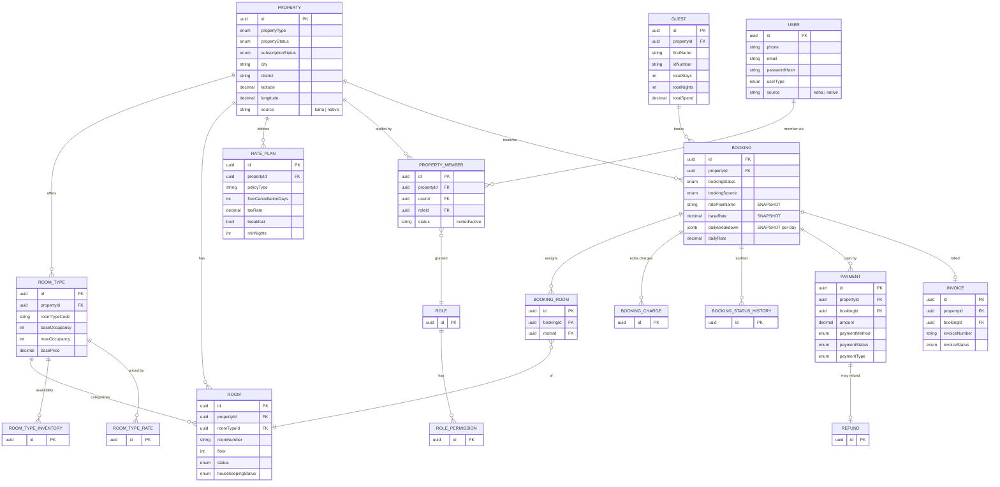

# Hotel System (HMS) — Data Model

> ℹ️ **Confluence page placement:** child of *Hotel System → Overview*.
>
> **Document standard:** arc42 §8 + ER model. Code-verified from `hms-api/src` entities (48 entities). **Scope:** core booking + tenant aggregate is diagrammed; careers/events content tables follow `BaseEntity` and are listed, not diagrammed (signal over noise).

---

## 1. Core ER Diagram

**In words (read this even if the diagram renders):**
**PROPERTY** is the tenant root — *every* core table carries `propertyId`. It offers **ROOM_TYPE**s (categories with occupancy/price), which classify physical **ROOM**s and drive **ROOM_TYPE_INVENTORY** (availability per date) and **ROOM_TYPE_RATE**.

A **BOOKING** belongs to a property and a **GUEST**, snapshots its rate (`ratePlanName`, `baseRate`, `dailyBreakdown[]`), assigns rooms via **BOOKING_ROOM**, accrues **BOOKING_CHARGE**s, logs transitions in **BOOKING_STATUS_HISTORY**, is paid via **PAYMENT** (→ optional **REFUND**) and billed via **INVOICE**.

Staff access is the **USER → PROPERTY_MEMBER → ROLE → ROLE_PERMISSION** chain — a user is a *member of a property* with a role (multi-tenant RBAC, same shape as kaha-main's `business-user`). `USER.source` / `PROPERTY.source` = `kaha` when provisioned via `kaha-sync`, else native.

---

## 2. Conventions

| Convention | Detail |
|---|---|
| **Tenant key** | `propertyId` on every core table — **the** isolation boundary |
| **PK** | `uuid` from `BaseEntity` |
| **Money** | `decimal(precision,scale)` — never float |
| **Rate snapshot** | Bookings copy rate-plan/day data at creation |
| **Origin tracking** | `source` column distinguishes Kaha-provisioned vs native records |
| **Audit** | `*-status-history` + `audit-log` are append-style trails |

---

## 3. Data Decisions

- **`propertyId` everywhere (shared-schema multi-tenancy)** — one DB, tenant-filtered, instead of DB-per-tenant. Cheaper ops; the trade-off is *every query must filter by property* (ADR-H01).
- **Rate snapshot on booking** — `dailyBreakdown[]` freezes nightly pricing so later rate edits don't rewrite confirmed bookings (same principle as ecommerce ADR-E01).
- **`source` discriminator** — lets Kaha-provisioned and natively-created properties/users coexist in one tenant model without separate tables.
- **Guest lifetime stats denormalized** (`totalStays/Nights/Spend`) — fast loyalty/reporting reads without aggregating all bookings.
- **PROPERTY_MEMBER join entity** — carries role + invitation state; a plain M:N table couldn't model "invited but not yet joined."

---

## 4. Where To Go Next

- Modules that own these tables → [architecture.md](architecture.md)
- Why multi-tenant / snapshot → [decisions.md](decisions.md)
