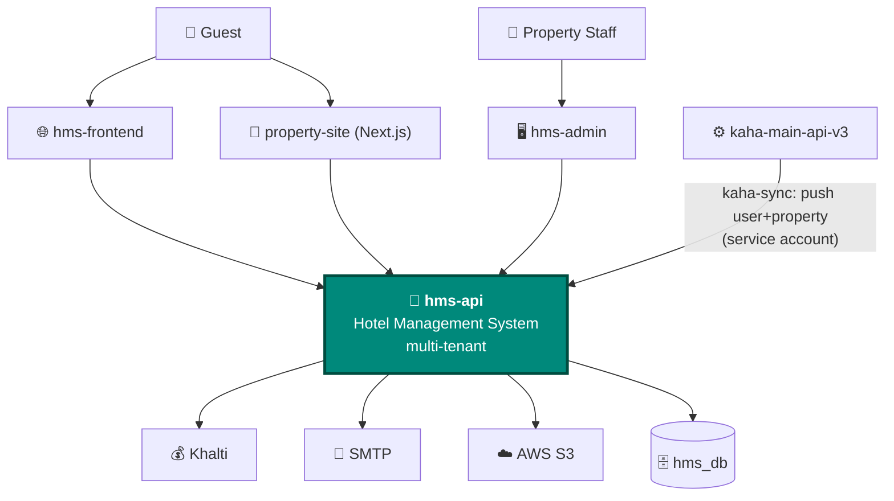

# Hotel System (HMS) — Overview & Context

> ℹ️ **Confluence page placement:** child of *Kaha Platform → Hotel*. Parent of the other hotel pages.
>
> **Document standard:** arc42 §1–3 + C4 Level 1. **Priority: High.**

| | |
|---|---|
| **Backend** | `kaha-app/hotel-backend` (private) — `…/hotel/hms-api` — NestJS, `hms-api` |
| **Guest frontend** | `esor111/hotel-world-frontend` — `…/hotel/hms-frontend` — React/Vite |
| **Admin panel** | `esor111/hotel-admin` — `…/hotel/hms-admin` — React/Vite |
| **Property website** | `esor111/property-site` — `…/hotel/property-site` — Next.js |
| **Stack** | NestJS · PostgreSQL · TypeORM · Khalti · SMTP · AWS S3 |
| **Multi-tenancy** | Every record scoped by `propertyId` |

---

## 1. Introduction & Goals

A full **Hotel Management System** — a self-contained product (booking engine, front desk, billing, housekeeping, careers site) that *also* plugs into the Kaha platform via an inbound sync.

| Goal | Why it exists |
|---|---|
| **Booking engine** | Room availability, rate plans, daily rates, reservations |
| **Front desk ops** | Check-in/out, room & housekeeping status, guests |
| **Billing** | Payments (Khalti), invoices, refunds, taxes, promo codes |
| **Multi-tenant** | One deployment serves many properties — strict `propertyId` isolation |
| **Kaha integration** | Provisioned from the backbone (a Kaha business → an HMS property) |

---

## 2. Constraints

| Constraint | Implication |
|---|---|
| **Multi-tenant by `propertyId`** | Every query must be property-scoped — cross-tenant leakage is the top risk |
| **Own database (`hms_db`)** | Not the backbone's DB; users/properties can originate from Kaha (`source='kaha'`) |
| **Khalti (Nepal) payments** | Test vs prod base URLs; webhook needs a public URL |
| **Separate JWT from backbone** | HMS has its own `JWT_SECRET` + refresh secret (NOT the platform shared secret) |
| **Inbound sync trust boundary** | kaha-main authenticates as a service account with `kaha-integration` role |

---

## 3. System Context (C4 — Level 1)

**In words:** three frontends (guest app, staff admin, marketing/careers site) all talk to `hms-api`. The integration with Kaha is **inbound**: `kaha-main-api-v3` calls the `kaha-sync` endpoint to provision a user + property into HMS (records stamped `source='kaha'`), authenticating as a service account holding the `kaha-integration` role. HMS itself reaches out to Khalti (payments), SMTP (email), and S3 (media).

> ⚠️ **HMS uses its own JWT secret**, not the platform-shared `JWT_SECRET_TOKEN`. Don't conflate them — see [decisions.md](decisions.md) ADR-H05.

---

## 4. Where To Go Next

| You want to… | Read |
|---|---|
| Modules, frontends, booking/payment flows | [architecture.md](architecture.md) |
| The multi-tenant data model | [data-model.md](data-model.md) |
| Why multi-tenant / own-JWT / sync design | [decisions.md](decisions.md) |
| Run all 4 repos locally / operate | [runbook.md](runbook.md) |
