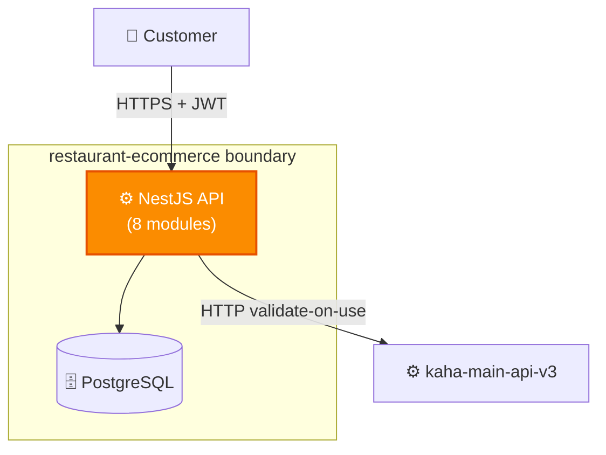
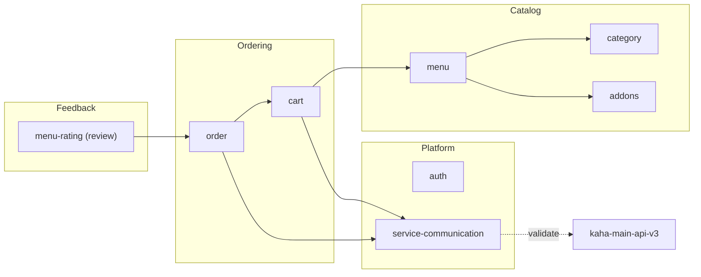
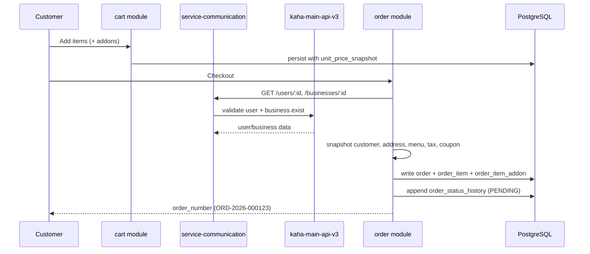
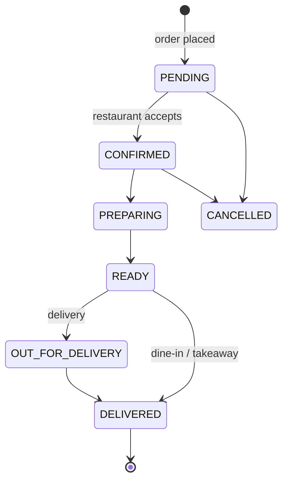

# restaurant-ecommerce — Architecture (Building Blocks)

> ℹ️ **Confluence page placement:** child of *restaurant-ecommerce → Overview*.
>
> **Document standard:** arc42 §5 + C4 Level 2/3 + key runtime flow.

---

## 1. Container View (C4 — Level 2)

---

## 2. Component View (C4 — Level 3): Modules

| Module | Responsibility |
|---|---|
| `category` | Menu categories per business (self-referential tree) |
| `menu` | Menu items + variants; pricing, dietary tags, services (dine-in/takeaway/delivery) |
| `addons` | Add-on groups + options (single/multi select, min/max) |
| `cart` | One cart per (user, business); items + selected addons with price snapshots |
| `order` | Order lifecycle, money math, status history, snapshots |
| `menu-rating` | Reviews — verified-purchase linked to `order_item` |
| `auth` | Validates the platform JWT |
| `service-communication` | `GET /users/:id`, `/businesses/:id`, `/business-users/:b/:u` on the backbone |

---

## 3. Key Runtime Flow: Cart → Order

**In words:** prices are snapshotted as early as cart time (`unit_price_snapshot`) and re-snapshotted comprehensively at order time (customer, address, menu name, tax rate, coupon). Validation against the backbone happens at checkout — not on every cart mutation — to keep the cart fast.

---

## 4. Order Status Lifecycle

`order.current_status` is denormalized for hot-path dashboard queries; the full transition log is **append-only** in `order_status_history` (see [data-model.md](data-model.md)).

---

## 5. Where To Go Next

- The snapshot data model → [data-model.md](data-model.md)
- Why validate-on-use / snapshots → [decisions.md](decisions.md)
