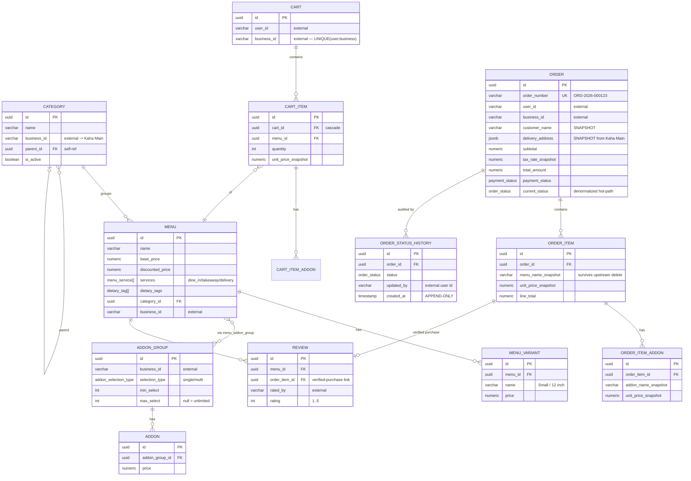

# restaurant-ecommerce — Data Model

> ℹ️ **Confluence page placement:** child of *restaurant-ecommerce → Overview*.
>
> **Document standard:** arc42 §8 + ER model. **Source of truth: `schema.dbml`** in the repo — this page explains it; the file *is* it.

---

## 1. ER Diagram

**In words (read this even if the diagram renders):**
The **catalog** side (CATEGORY → MENU → MENU_VARIANT, plus ADDON_GROUP/ADDON joined many-to-many via `menu_addon_group`) is mutable and lives only here. The **cart** is one-per-(user,business) and snapshots unit price at add time. The **order** side snapshots *everything*: customer identity, delivery address (copied from Kaha Main), menu/variant/addon names, tax rate, coupon. `ORDER_STATUS_HISTORY` is **append-only** (no `updated_at`, no `deleted_at`) — an immutable audit trail; `order.current_status` is a denormalized copy for fast dashboards. `REVIEW` links to `order_item` to enforce verified-purchase.

---

## 2. The Snapshot Pattern (the defining design)

| Snapshotted field | Source | Why |
|---|---|---|
| `customer_name/phone/email` | Kaha Main user | Order receipt must show who ordered, even if profile later changes/deletes |
| `delivery_address` (jsonb) | Kaha Main address | Delivery proof frozen at order time |
| `menu_name_snapshot` | local menu | Survives menu rename/delete |
| `unit_price_snapshot` | local menu/variant | Price the customer actually paid, immune to later price edits |
| `tax_rate_snapshot` | tax config | Historical tax correctness |
| `coupon_code_snapshot` | promo | Audit which discount applied |

> ⚠️ **Never resolve order display data by joining live catalog/user tables.** That would retroactively rewrite financial history. Always read the `*_snapshot` columns for anything order-historical.

---

## 3. Conventions

| Convention | Detail |
|---|---|
| **PK** | `uuid` |
| **Money** | `numeric(12,2)`; tax rate `numeric(5,4)`; currency `char(3)` default `NPR` |
| **External refs** | `user_id` / `business_id` are `varchar`, indexed, **no FK** (platform ADR-002) |
| **Soft delete** | `deleted_at` on catalog/order; **except** `order_status_history` (append-only) |
| **Hot-path indexes** | `(business_id, current_status, created_at)` dashboard; `(user_id, created_at)` history |

---

## 4. Where To Go Next

- Modules operating this → [architecture.md](architecture.md)
- The reasoning behind snapshots → [decisions.md](decisions.md)
