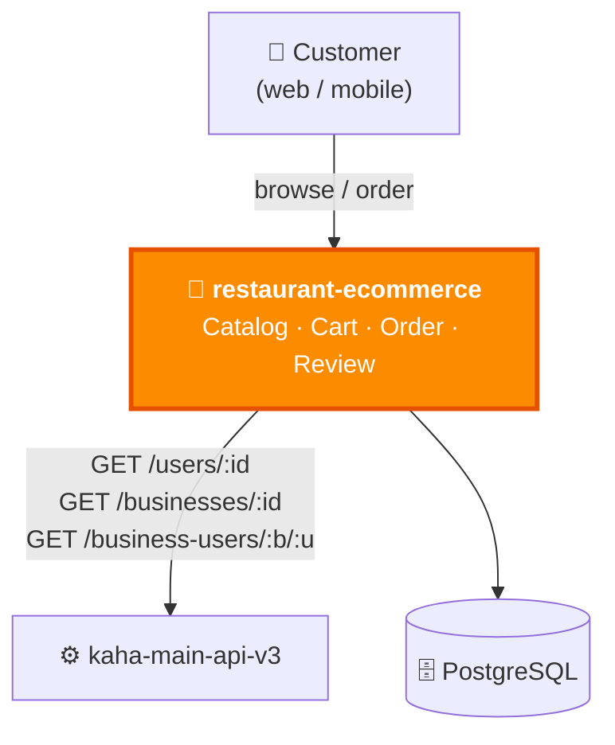

# restaurant-ecommerce — Overview & Context

> ℹ️ **Confluence page placement:** child of *Kaha Platform → Services*. Parent of the other `restaurant-ecommerce` pages.
>
> **Document standard:** arc42 §1–3 + C4 Level 1.

| | |
|---|---|
| **Repository** | `esor111/restaurant-ecommerce` |
| **Local path** | `C:/Users/ishwor/Music/own-organize/arju/restaurant-ecommerce` |
| **Stack** | NestJS · TypeScript · PostgreSQL · TypeORM |
| **Authoritative design** | `schema.dbml` in repo root (paste into [dbdiagram.io](https://dbdiagram.io)) |
| **Role** | Food-ordering bounded context — catalog → cart → order → review |

---

## 1. Introduction & Goals

A standalone **food-ordering** service for restaurants listed on Kaha. It owns the ordering domain end to end but **does not own users or businesses** — those stay in the backbone.

| Goal | Why it exists |
|---|---|
| **Catalog** | Menus, variants, add-on groups per restaurant |
| **Cart** | One live cart per (user, restaurant) |
| **Order** | Full lifecycle with financial integrity |
| **Review** | Verified-purchase ratings |
| **Isolation** | Ordering can evolve/scale without touching the backbone |

---

## 2. Constraints

| Constraint | Implication |
|---|---|
| **No user/business ownership** | Validated via HTTP to `kaha-main-api-v3` at write time |
| **Financial history must survive upstream edits** | Heavy snapshot pattern on orders |
| **`schema.dbml` is the source of truth** | Update it with any schema change — it's the design contract |
| **Shared `JWT_SECRET_TOKEN`** | Validates the same platform JWT |

---

## 3. System Context (C4 — Level 1)

**In words:** customers interact with this service for everything ordering-related. Before trusting a `userId` / `businessId`, it calls the backbone to confirm they exist (validate-on-use). It is the **only satellite that calls the backbone inward**.

> ℹ️ **Bounded context boundary:** users/businesses/addresses live in Kaha Main and are referenced by external string IDs. Customer/address/menu data is *snapshotted* onto orders so financial history survives upstream deletes/edits.

---

## 4. Where To Go Next

| You want to… | Read |
|---|---|
| Modules & the order runtime flow | [architecture.md](architecture.md) |
| The full data model (snapshot design) | [data-model.md](data-model.md) |
| Why snapshot / why no FKs | [decisions.md](decisions.md) |
| Run / operate it | [runbook.md](runbook.md) |
