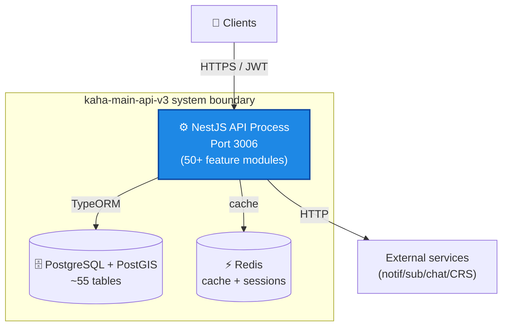
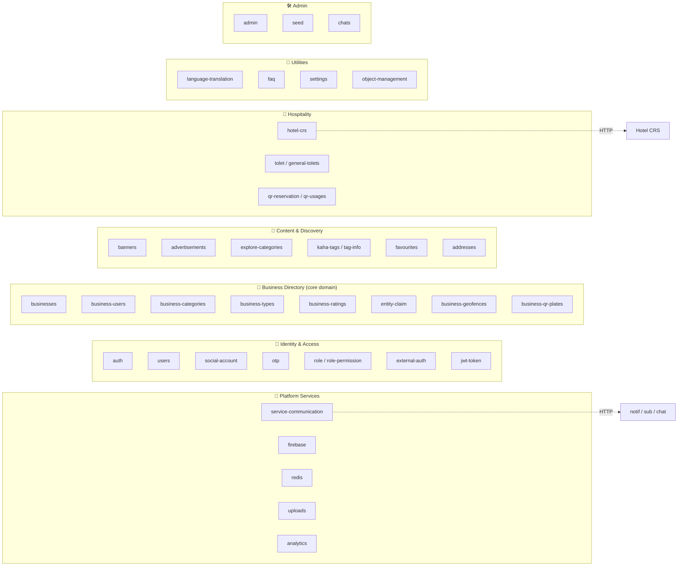
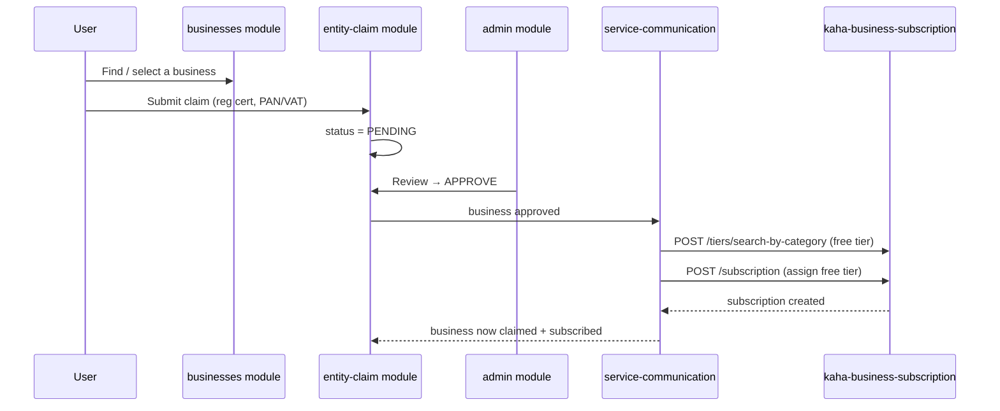

# kaha-main-api-v3 — Architecture (Building Blocks)

> ℹ️ **Confluence page placement:** child of *kaha-main-api-v3 → Overview*.
>
> **Document standard:** arc42 §5 (Building Block View) + C4 Level 2/3 (Container & Component).

---

## 1. Container View (C4 — Level 2)

Inside the system boundary: the API process, its database, and its caches.

**In words:** a single NestJS process serves all traffic on port 3006, persists to one PostgreSQL+PostGIS database via TypeORM, uses Redis for caching, and reaches external services over HTTP. It is a **modular monolith**, not microservices internally — 50+ modules in one deployable.

---

## 2. Component View (C4 — Level 3): Module Groups

The 50+ modules cluster into seven functional domains. This is the map to navigate the codebase.

> ℹ️ **How to use this:** when a ticket says "fix the claim flow", you go to the **Business Directory** group → `entity-claim` + `businesses` + `service-communication` (claims trigger a subscription call). The groups tell you which modules collaborate.

---

## 3. Module Reference

### 🔐 Identity & Access

| Module | Responsibility | Notes |
|---|---|---|
| `auth` | Login, register, refresh, OTP verify, Google social login | Issues JWT signed with `JWT_SECRET_TOKEN` |
| `users` | User CRUD, profile, role assignment | `kahaId` is the unique public identifier |
| `social-account` | Google OAuth account linking | One user ↔ many social accounts |
| `otp` | OTP generation/verification | Phone/email verification flow |
| `role` / `role-permission` | RBAC definitions | Roles are assigned per-business via `business-users` |
| `external-auth` | Lets other services validate users | Part of the stateless-auth model |
| `jwt-token` | Token lifecycle | Issue / refresh / invalidate |

### 🏢 Business Directory (core domain)

| Module | Responsibility | Notes |
|---|---|---|
| `businesses` | Core business CRUD | Has PostGIS `location`; self-referential (parent/child, located-in) |
| `business-users` | Who manages which business + their role | The pivot of access control |
| `business-categories` | Category tree (self-referential) | Drives the free-tier-by-category logic in subscription |
| `business-types` | Business type taxonomy | Many-to-many with categories |
| `business-ratings` | Reviews & stars | |
| `entity-claim` | Ownership claim workflow | Submits cert docs → admin reviews → triggers subscription |
| `business-geofences` | Geo boundary detection | PostGIS spatial queries |
| `business-qr-plates` | Per-business QR generation | Links to `qr-reservation` / `qr-usages` |

### 🏨 Hospitality

| Module | Responsibility | Notes |
|---|---|---|
| `hotel-crs` | Proxy to 3rd-party CRS | Service-account auth, token auto-refresh (ADR-004) |
| `tolet` / `general-tolets` | Room/flat rental listings | "To Let" — Nepal rental market |
| `qr-reservation` / `qr-usages` | QR-based table/room reservation | Scan-to-reserve |

### 🔌 Platform Services

| Module | Responsibility | Notes |
|---|---|---|
| `service-communication` | **The outbound HTTP hub** | All calls to notif/sub leave from here — single place to audit integrations |
| `firebase` | FCM token registration wrapper | |
| `uploads` | S3 upload pipeline | Original + compressed bucket |
| `analytics` | Event tracking | |
| `chats` | Chat proxy + enrich | Calls chat service, hydrates with user/business data (ADR-003) |

---

## 4. Key Runtime Flow: Business Claim → Subscription

The most important cross-module + cross-service flow in the system.

**In words:** a user claims a business by uploading their registration and PAN/VAT certificates. The claim sits `PENDING` until a platform admin approves it. On approval, `service-communication` asks the subscription service for the correct *free tier for that business's category*, then creates the subscription. This is why `business-categories` matters beyond display — it determines billing defaults.

---

## 5. Where To Go Next

- Data model behind these modules → [data-model.md](data-model.md)
- Why the modular-monolith / proxy choices → [decisions.md](decisions.md)
