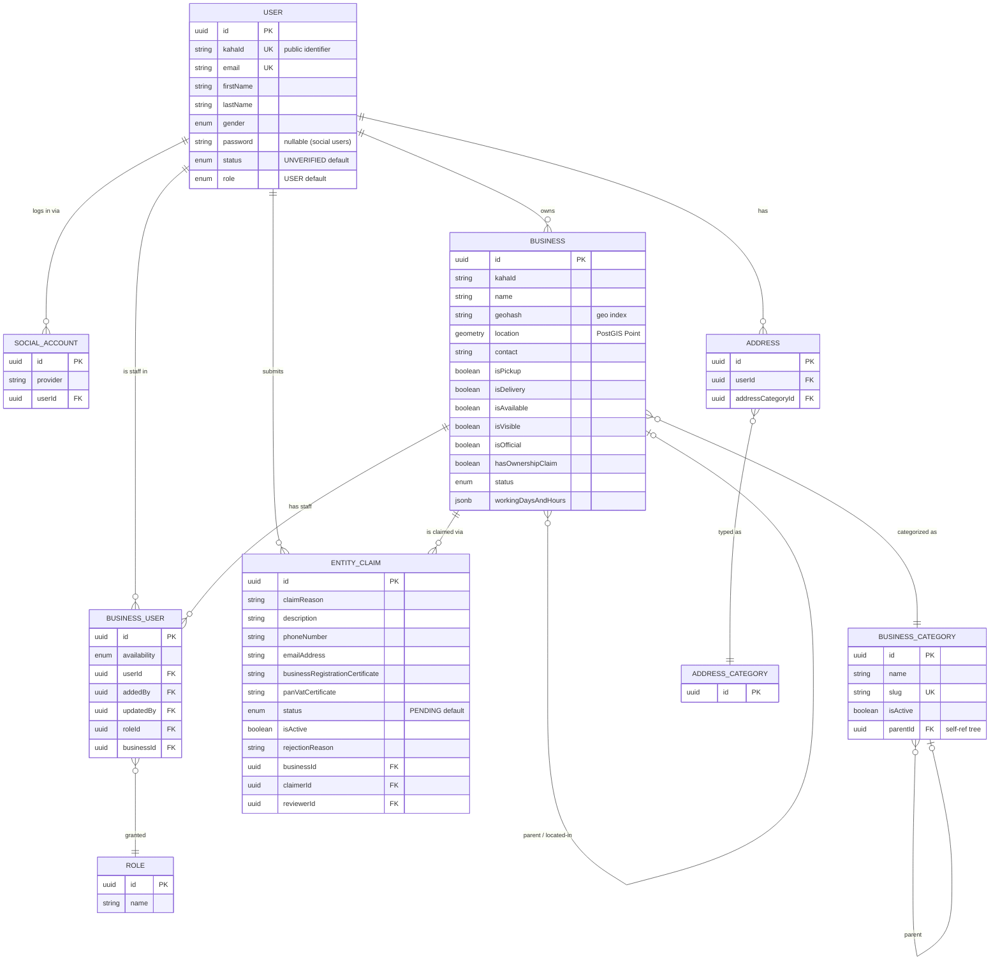

# kaha-main-api-v3 — Data Model

> ℹ️ **Confluence page placement:** child of *kaha-main-api-v3 → Overview*.
>
> **Document standard:** arc42 §8 (Crosscutting — Persistence) + domain ER model.
> **Scope decision:** ~55 tables exist. This documents the **core domain aggregate** (identity + business directory). Peripheral tables (banners, FAQ, analytics, i18n) follow the same `BaseEntity` pattern and are not individually diagrammed — *documenting all 55 would be noise, not signal*.

---

## 1. Core Domain ER Diagram

**In words (read this even if the diagram renders):**
A **USER** is the identity anchor — uniquely keyed by `kahaId` (a phone-derived public ID) and `email`. A user can own many **BUSINESS**es, be staff in many via **BUSINESS_USER**, log in through multiple **SOCIAL_ACCOUNT**s, and have many **ADDRESS**es.

A **BUSINESS** is the core domain object. It is self-referential twice: `parentBusiness` (franchise/branch hierarchy) and `locatedInBusiness` (e.g. a stall inside a mall). It carries a real PostGIS `location` for geo queries. It's classified by a **BUSINESS_CATEGORY**, which is itself a self-referential tree.

**BUSINESS_USER** is the access-control pivot: it ties a *user* + a *role* + a *business* together, plus audit columns (`addedBy`, `updatedBy`). This is how "User X is a Manager at Business Y" is expressed.

**ENTITY_CLAIM** is the ownership workflow: a claimer submits certificates, a reviewer (admin) approves/rejects, `status` walks `PENDING → APPROVED/REJECTED`. Approval is what wires the business into the subscription service.

---

## 2. Conventions (all tables)

| Convention | Detail |
|---|---|
| **Primary key** | `uuid`, generated, inherited from `BaseEntity` — never integer IDs |
| **Timestamps** | `BaseEntity` provides created/updated columns on every table |
| **Spatial** | `location` / geo columns use PostGIS `geometry` — requires the PostGIS extension |
| **Cross-service refs** | External IDs (from notif/sub/ecom) are plain indexed strings, **never FKs** (platform rule) |
| **Soft-ish state** | Many entities use an `isActive` / `status` enum rather than hard deletes |
| **JSON columns** | Flexible structures (`workingDaysAndHours`, galleries) use `jsonb` |

---

## 3. Data Decisions

> These are summarized here and recorded formally in [decisions.md](decisions.md).

- **`kahaId` as public identifier (not the UUID PK)** — the UUID is internal; `kahaId` is what's shared externally and is phone-derived for the Nepal phone-first market.
- **`BUSINESS_USER` as an explicit join entity, not a many-to-many table** — because the relationship *carries data* (role, availability, audit). A plain join table couldn't hold "who added this staff member."
- **Self-referential `BUSINESS`** — one table models franchises, branches, and "located-in" (shop-in-mall) instead of separate tables. Trade-off: recursive queries; benefit: one consistent business model.
- **Snapshots happen downstream, not here** — this DB is the *living source of truth*; services that need historical accuracy (ecommerce orders) snapshot **from** here.

---

## 4. Where To Go Next

- The modules that own these tables → [architecture.md](architecture.md)
- Migration / DB setup commands → [runbook.md](runbook.md)
