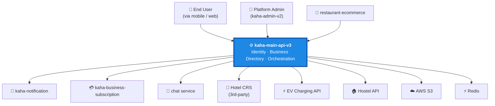

# kaha-main-api-v3 — Overview & Context

> ℹ️ **Confluence page placement:** child of *Kaha Platform → Services*. Parent of the other four `kaha-main-api-v3` pages.
>
> **Document standard:** arc42 §1–3 (Introduction, Constraints, Context) + C4 Level 1 (System Context).

| | |
|---|---|
| **Repository** | `kaha-app/kaha-main-api-v3` (private) |
| **Local path** | `D:/shared-code/code/kaha-main-api-v3` |
| **Stack** | NestJS · TypeScript · PostgreSQL + PostGIS · Redis · AWS S3 · TypeORM |
| **Default port** | `3006` |
| **Role** | Platform backbone — single source of truth for identity & business data |

---

## 1. Introduction & Goals

`kaha-main-api-v3` is the **central backbone** of the Kaha platform. Its responsibilities:

| Goal | Why it exists |
|---|---|
| **Identity** | One authoritative user store + auth (JWT, OTP, Google social login) for the entire platform |
| **Business directory** | The core domain — businesses, categories, ratings, geo, QR plates, claims |
| **Orchestration** | Calls notification / subscription / chat services on behalf of clients |
| **Hotel CRS proxy** | Bridges the platform to a 3rd-party reservation system |
| **Media** | Centralized S3 upload pipeline |

> ℹ️ **The one-sentence summary:** every other service depends on this one for *who the user is* and *what the business is*.

---

## 2. Constraints

These are non-negotiable and shape every design choice.

| Constraint | Implication |
|---|---|
| **Database-per-service** (platform rule) | This service's DB cannot be `JOIN`ed from others — they call it over HTTP |
| **Shared `JWT_SECRET_TOKEN`** across all services | Token rotation = coordinated platform-wide deploy |
| **PostGIS required** | Must use `postgis/postgis` Docker image; geo features depend on spatial columns |
| **Nepal market** | Phone-first identity (`kahaId`), Khalti payments downstream, Nepali/English i18n |
| **3rd-party CRS** | Hotel reservations are not owned — proxied with service-account auth |

---

## 3. System Context (C4 — Level 1)

This is the **outermost view**: the system as one box, and everyone it talks to.

**In words (read this even if the diagram renders):**
End users and platform admins talk *to* `kaha-main-api-v3`. The backbone in turn calls out to six systems — notification, subscription, chat, the 3rd-party Hotel CRS, the EV charging API, and the Hostel API — plus infrastructure (S3 for files, Redis for cache). Only one system calls *inward*: `restaurant-ecommerce`, which asks the backbone "is this user/business real?" before accepting an order.

> ⚠️ **Single point of failure (by design).** If this service is down, the platform is down. This is the deliberate trade-off of a backbone architecture — see [decisions.md](decisions.md) ADR-001. Any HA effort starts here.

For the full integration mechanics (patterns, failure behavior), see [`../service-architecture.md`](../service-architecture.md).

---

## 4. Where To Go Next

| You want to… | Read |
|---|---|
| Understand the internal modules | [architecture.md](architecture.md) |
| Understand the database | [data-model.md](data-model.md) |
| Understand *why* it's built this way | [decisions.md](decisions.md) |
| Run it locally / operate it | [runbook.md](runbook.md) |
