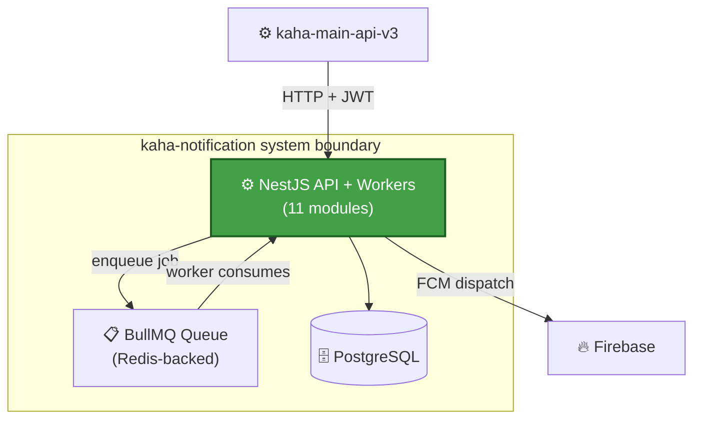
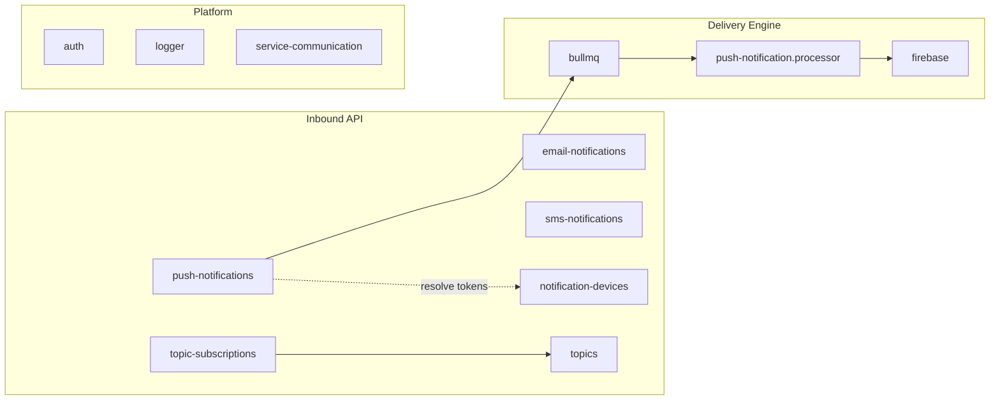
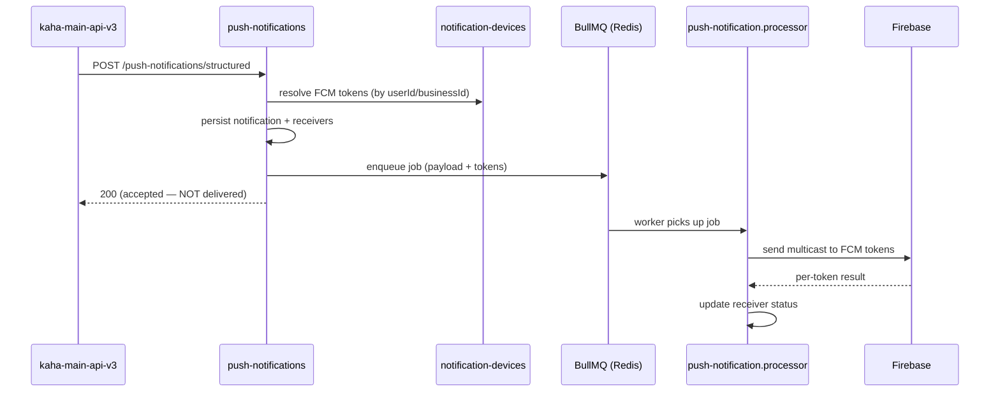

# kaha-notification — Architecture (Building Blocks)

> ℹ️ **Confluence page placement:** child of *kaha-notification → Overview*.
>
> **Document standard:** arc42 §5 + C4 Level 2/3 + key runtime flow.

---

## 1. Container View (C4 — Level 2)

**In words:** the same deployable runs both the HTTP API and the BullMQ worker. An incoming push request is *persisted + enqueued*, then a worker consumes the job and dispatches to Firebase. Email and SMS are sent more directly. The queue is the decoupling layer.

---

## 2. Component View (C4 — Level 3): Modules

| Module | Responsibility |
|---|---|
| `push-notifications` | Receives push request, persists `notification`, enqueues to BullMQ. Contains `push-notification.processor.ts` (the worker) + `NotificationMeta` (deep-link/payload shape) |
| `email-notifications` | Transactional email via Nodemailer (`@nestjs-modules/mailer`) |
| `sms-notifications` | SMS dispatch to provider |
| `notification-devices` | FCM token registry — register on login, delete on logout, bulk token lookup by `userIds` |
| `topics` | Topic catalogue (`name`, `isActive`) |
| `topic-subscriptions` | User/business ↔ topic membership; cascade-deletes with topic |
| `bullmq` | Queue wiring (Redis connection, queue definitions) |
| `firebase` | `firebase-admin` wrapper — actual FCM send |
| `auth` | Validates the forwarded JWT (shared secret) |
| `logger` | Structured logging |
| `service-communication` | Outbound HTTP (reserved / token resolution) |

---

## 3. Key Runtime Flow: Structured Push

**In words:** the HTTP response means *accepted*, not *delivered*. Token resolution and persistence happen synchronously; the actual Firebase send happens asynchronously in the worker. Per-recipient outcome is tracked on `notification-receiver.status`.

> ℹ️ **Debugging missing push:** check (1) was a `notification` row written? (2) did a BullMQ job get created? (3) did the worker run? (4) what is `notification-receiver.status`? This sequence is the debugging order.

---

## 4. Where To Go Next

- Tables behind these modules → [data-model.md](data-model.md)
- Why queue / fire-and-forget → [decisions.md](decisions.md)
