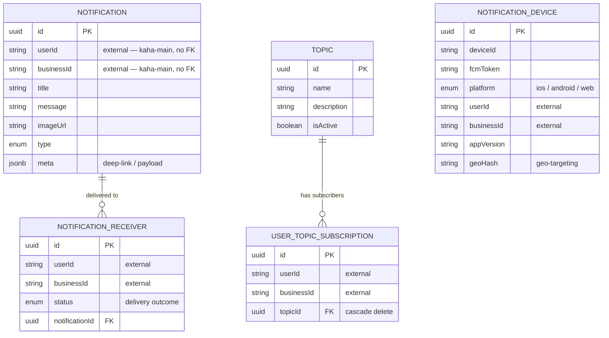

# kaha-notification — Data Model

> ℹ️ **Confluence page placement:** child of *kaha-notification → Overview*.
>
> **Document standard:** arc42 §8 + domain ER model. Code-verified from `src/entities`.

---

## 1. ER Diagram

**In words (read this even if the diagram renders):**
A **NOTIFICATION** is one logical message (title, body, image, typed, with `meta` for deep-linking). It fans out to many **NOTIFICATION_RECEIVER** rows — one per recipient — each carrying a `status` so per-recipient delivery is tracked.

**NOTIFICATION_DEVICE** is the FCM token registry: which device/token belongs to which user, on which platform, plus `appVersion` and `geoHash` for targeted/geo campaigns.

**TOPIC** + **USER_TOPIC_SUBSCRIPTION** are a pub/sub pair: a topic has many subscribers; deleting a topic cascade-deletes its subscriptions.

> ℹ️ **No foreign keys to users/businesses.** `userId` / `businessId` are plain external string references owned by `kaha-main-api-v3` (platform rule — see [../kaha-main-api/decisions.md](../kaha-main-api/decisions.md) ADR-002). This service never validates them; it just stores and dispatches.

---

## 2. Conventions

| Convention | Detail |
|---|---|
| **PK** | `uuid` from `BaseEntity` |
| **Timestamps** | `BaseEntity` created/updated on every table |
| **External refs** | `userId` / `businessId` are indexed strings, never FKs |
| **Delivery state** | Lives on `NOTIFICATION_RECEIVER.status`, not on `NOTIFICATION` (per-recipient granularity) |
| **Cascade** | `USER_TOPIC_SUBSCRIPTION` cascade-deletes with its `TOPIC` |

---

## 3. Data Decisions

- **Notification ↔ receiver split** — one message, many receivers, status per receiver. Lets one push to 1,000 users report 998 delivered / 2 failed instead of a single opaque success.
- **Device registry separate from receivers** — tokens churn (reinstalls, logout); decoupling them means a stale token doesn't corrupt notification history.
- **`geoHash` on device** — enables geo-targeted campaigns without the backbone resolving recipients itself.
- **`meta` as jsonb** — push payload/deep-link shape varies per `type`; schema-on-read avoids a migration per new notification kind.

---

## 4. Where To Go Next

- Modules that own these tables → [architecture.md](architecture.md)
- Migration commands → [runbook.md](runbook.md)
