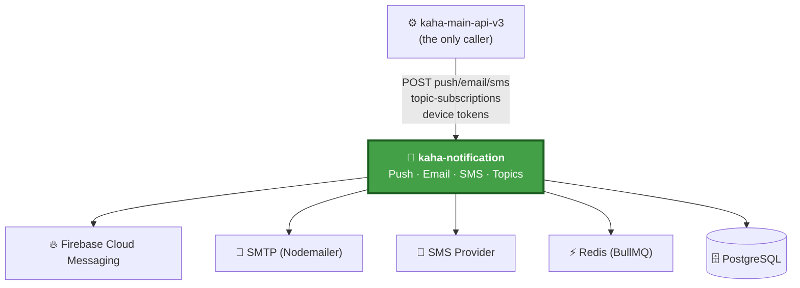

# kaha-notification — Overview & Context

> ℹ️ **Confluence page placement:** child of *Kaha Platform → Services*. Parent of the other `kaha-notification` pages.
>
> **Document standard:** arc42 §1–3 + C4 Level 1 (System Context).

| | |
|---|---|
| **Repository** | `kaha-app/kaha-notification` (private) |
| **Local path** | `D:/shared-code/code/notifications-projects/kaha-notification` |
| **Stack** | NestJS · TypeScript · PostgreSQL · BullMQ (Redis) · Firebase Admin · Nodemailer |
| **Role** | Outbound communication service — push, email, SMS, topics |

---

## 1. Introduction & Goals

A dedicated service that owns **all outbound communication** for the platform. It exists so the backbone never talks to Firebase / SMTP / SMS providers directly.

| Goal | Why it exists |
|---|---|
| **Centralize delivery** | One place owns FCM, email, SMS — providers can change without touching the backbone |
| **Decouple slow I/O** | Push dispatch is queued (BullMQ), so a slow Firebase call never blocks a user action |
| **Device registry** | Authoritative store of which FCM token belongs to which user |
| **Topic pub/sub** | Broadcast to subscriber groups (e.g. "business-updates") without per-user fan-out at the call site |

---

## 2. Constraints

| Constraint | Implication |
|---|---|
| **Never called by frontend** | Only `kaha-main-api-v3` calls it — its API is an internal contract, not public |
| **Shared `JWT_SECRET_TOKEN`** | Validates the same JWT the backbone forwards |
| **Fire-and-forget contract** | Callers do not await delivery success — losses must be observable *here*, not upstream |
| **Redis required** | BullMQ is Redis-backed; no Redis = no push queue |

---

## 3. System Context (C4 — Level 1)

**In words:** the backbone is the *only* client. The service fans out to Firebase (push), SMTP (email), an SMS provider, uses Redis for its BullMQ job queue, and persists notifications/devices/topics to its own PostgreSQL.

> ⚠️ **Losses are silent by design.** The backbone calls this service fire-and-forget ([../kaha-main-api/decisions.md](../kaha-main-api/decisions.md) ADR-005). If a push goes missing, the evidence is *here* (BullMQ queue + this service's logs), never in the backbone.

---

## 4. Where To Go Next

| You want to… | Read |
|---|---|
| Understand the internal modules & the queue flow | [architecture.md](architecture.md) |
| Understand the database | [data-model.md](data-model.md) |
| Understand *why* it's built this way | [decisions.md](decisions.md) |
| Run it locally / operate it | [runbook.md](runbook.md) |
