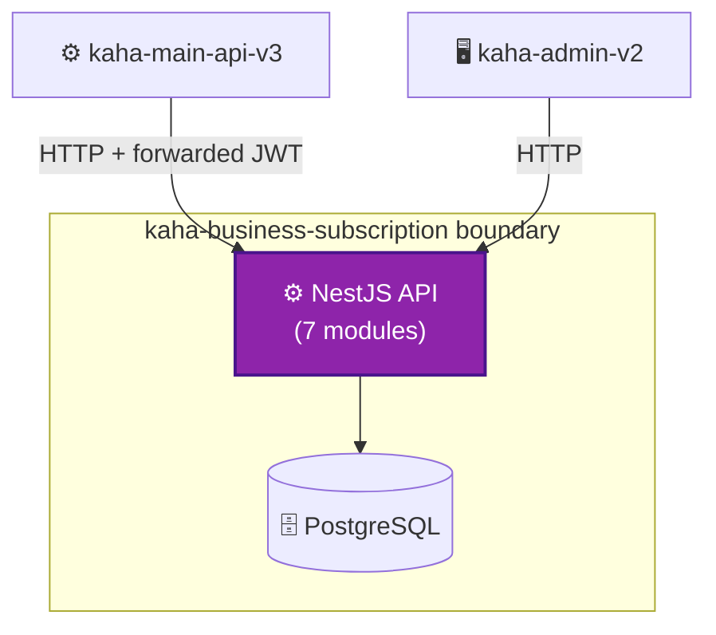
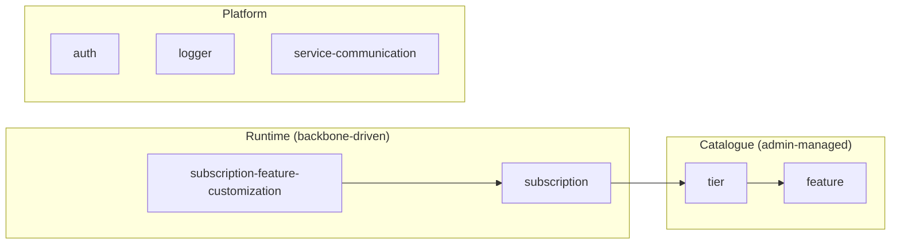
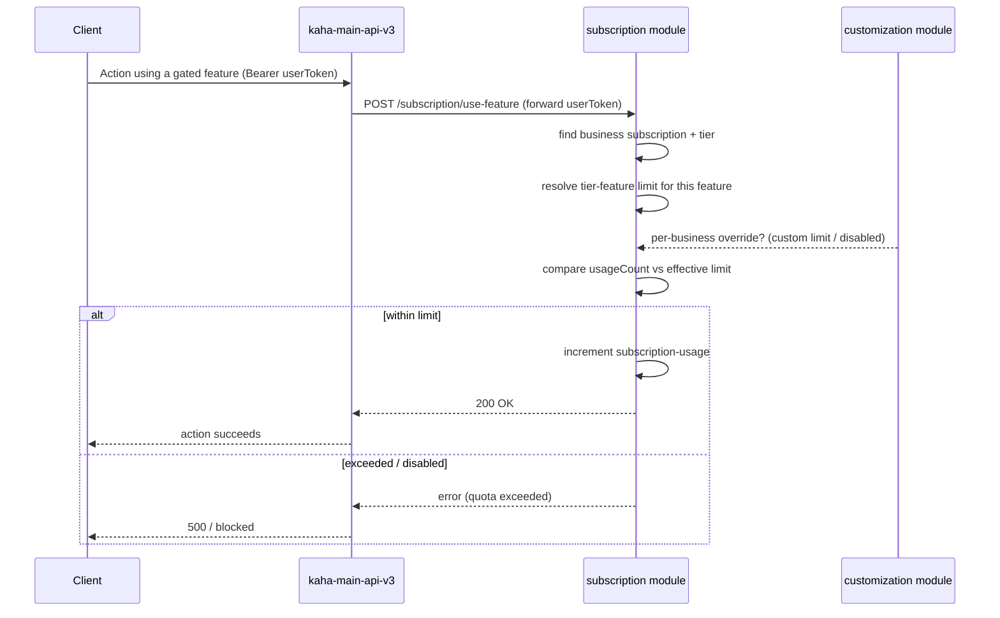

# kaha-business-subscription — Architecture (Building Blocks)

> ℹ️ **Confluence page placement:** child of *kaha-business-subscription → Overview*.
>
> **Document standard:** arc42 §5 + C4 Level 2/3 + key runtime flow.

---

## 1. Container View (C4 — Level 2)

A single NestJS service over one PostgreSQL. Two caller roles: the **backbone** (runtime gating) and the **admin panel** (catalogue management).

---

## 2. Component View (C4 — Level 3): Modules

| Module | Responsibility |
|---|---|
| `tier` | Plan definitions — name, price, `categoryId`. A tier bundles features with per-feature limits |
| `feature` | Feature catalogue — `name`, `type`, `isCountable` (metered vs boolean capability) |
| `subscription` | Business ↔ tier assignment with `status`, `startDate`/`endDate`, `allowCustomization`; tracks usage |
| `subscription-feature-customization` | Per-business override of a feature's enabled-state / limit on top of its tier |
| `auth` | Validates the forwarded JWT (shared secret) |
| `logger` | Structured logging |
| `service-communication` | Outbound HTTP (reserved) |

---

## 3. Key Runtime Flow: Use a Gated Feature

**In words:** the *effective* limit = tier's `tier-feature.usagesLimit`, **unless** a `subscription-feature-customization` row overrides it for that business. If the feature is countable and within the effective limit, `subscription-usage.usageCount` is incremented; otherwise the action is blocked. This is why a feature change can be done two ways: edit the tier (affects all businesses on it) or add a customization (affects one business).

---

## 4. Free-Tier-by-Category (claim integration)

When a business is approved in the backbone, it asks this service for the **free tier matching the business's category** (`POST /tiers/search-by-category`), then creates a subscription. Tiers carry `categoryId` precisely so the right free plan is auto-assigned per category.

---

## 5. Where To Go Next

- The tables behind this → [data-model.md](data-model.md)
- Why tier/feature/customization are separate → [decisions.md](decisions.md)
