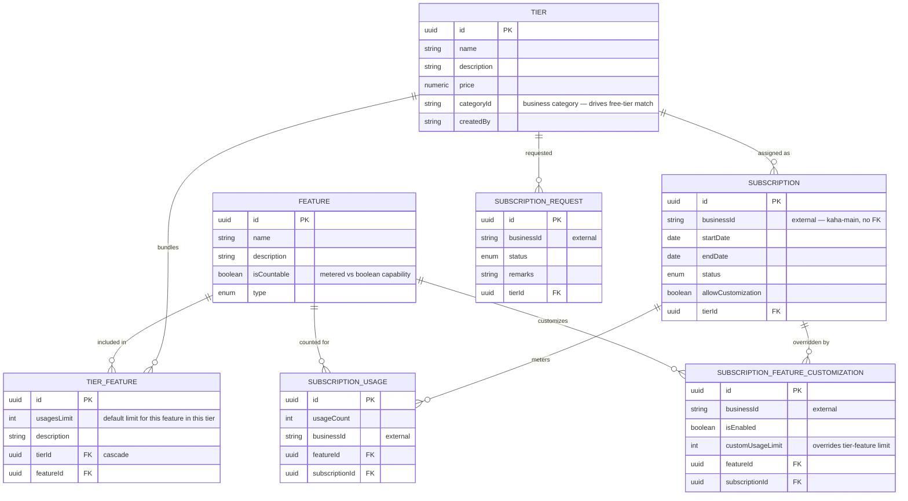

# kaha-business-subscription — Data Model

> ℹ️ **Confluence page placement:** child of *kaha-business-subscription → Overview*.
>
> **Document standard:** arc42 §8 + ER model. Code-verified from `src/entities`.

---

## 1. ER Diagram

**In words (read this even if the diagram renders):**
**TIER** is a plan. **FEATURE** is a capability. **TIER_FEATURE** is the join that says "this tier includes this feature, with this `usagesLimit`" — this is the catalogue.

**SUBSCRIPTION** binds an (external) `businessId` to a tier with a validity window and `status`. **SUBSCRIPTION_USAGE** meters how many times a business used a countable feature. **SUBSCRIPTION_FEATURE_CUSTOMIZATION** is the per-business escape hatch: enable/disable a feature or set a `customUsageLimit` that overrides the tier default. **SUBSCRIPTION_REQUEST** is the tier-change workflow (pending → approved/rejected with `remarks`).

> ℹ️ **Effective limit resolution:** `customUsageLimit` (if a customization row exists) **else** `TIER_FEATURE.usagesLimit`. Compared against `SUBSCRIPTION_USAGE.usageCount`. This three-table interaction is the heart of the service.

---

## 2. Conventions

| Convention | Detail |
|---|---|
| **PK** | `uuid` from base/root entity |
| **Audit** | `createdBy` / `updatedBy` / `deletedBy` on catalogue entities |
| **External ref** | `businessId` is an indexed string, never FK (platform ADR-002) |
| **Cascade** | `TIER_FEATURE` cascade-deletes with its `TIER` |
| **Money** | `price` is numeric (no float) |

---

## 3. Data Decisions

- **Tier ≠ Feature ≠ Tier-Feature** — a normalized catalogue so one feature can sit in many tiers at different limits without duplication.
- **Customization is additive, not destructive** — overrides live in their own table; the tier stays clean and one-off deals don't pollute the catalogue.
- **`categoryId` on tier** — enables automatic free-tier assignment per business category at claim time (the backbone integration point).
- **Usage is its own table, keyed by subscription + feature** — supports per-feature metering and reset/rollover without touching the subscription row.
- **`subscription-request` separate from `subscription`** — the *desire* to change a plan is distinct from the *active* plan; preserves an auditable change history.

---

## 4. Where To Go Next

- Modules operating this model → [architecture.md](architecture.md)
- Migration commands → [runbook.md](runbook.md)
