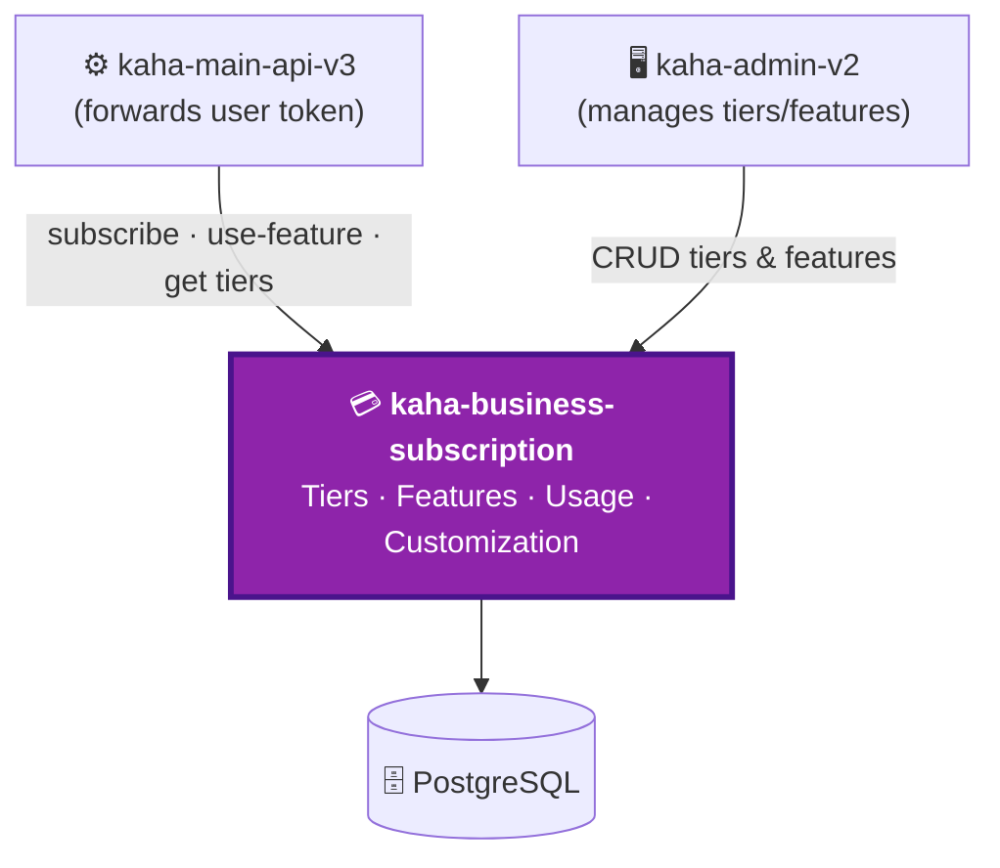

# kaha-business-subscription — Overview & Context

> ℹ️ **Confluence page placement:** child of *Kaha Platform → Services*. Parent of the other `kaha-business-subscription` pages.
>
> **Document standard:** arc42 §1–3 + C4 Level 1.

| | |
|---|---|
| **Repository** | `kaha-app/kaha-business-subscription` (private) |
| **Local path** | `D:/shared-code/code/kaha-business-subscription/kaha-business-subscription` |
| **Stack** | NestJS · TypeScript · PostgreSQL · TypeORM |
| **Role** | Business billing — tiers, feature quotas, usage metering |

---

## 1. Introduction & Goals

Owns **what a business is allowed to do** on the platform. When a business is claimed, it gets a subscription tier; every gated action checks and meters against this service.

| Goal | Why it exists |
|---|---|
| **Tier catalogue** | Define plans (Free, Premium…) priced per business category |
| **Feature gating** | Decide if a business may use a feature, and how much |
| **Usage metering** | Count consumption of countable features against a limit |
| **Per-business overrides** | Sales/ops can customize one business's limits without a new tier |
| **Change requests** | Workflow for a business requesting a tier change |

---

## 2. Constraints

| Constraint | Implication |
|---|---|
| **Called by the backbone with the user's token** | Validates the forwarded JWT (shared secret) |
| **Synchronous & failure-propagating** | Unlike notifications — if this 500s, the gated action 500s ([../service-architecture.md](../service-architecture.md) Pattern B) |
| **Free tier is category-dependent** | A restaurant's free tier ≠ a hotel's — driven by `categoryId` |
| **`businessId` is external** | Owned by `kaha-main-api-v3`, stored as a plain string |

---

## 3. System Context (C4 — Level 1)

**In words:** the backbone calls this service on every subscription-gated action (forwarding the end-user's JWT). The admin panel manages the tier/feature catalogue. State persists to its own PostgreSQL.

> ⚠️ **This is a hard dependency for gated actions.** Failure here propagates — a down subscription service makes feature-gated business actions return 500. Non-gated flows are unaffected.

---

## 4. Where To Go Next

| You want to… | Read |
|---|---|
| Modules & the gating runtime flow | [architecture.md](architecture.md) |
| The billing data model | [data-model.md](data-model.md) |
| Why it's modeled this way | [decisions.md](decisions.md) |
| Run / operate it | [runbook.md](runbook.md) |
