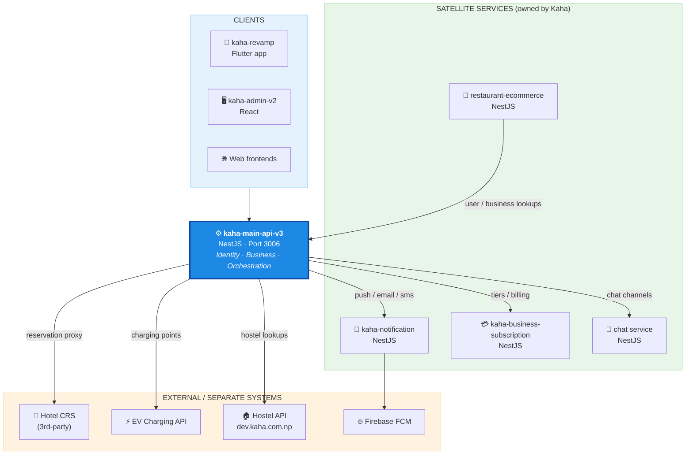
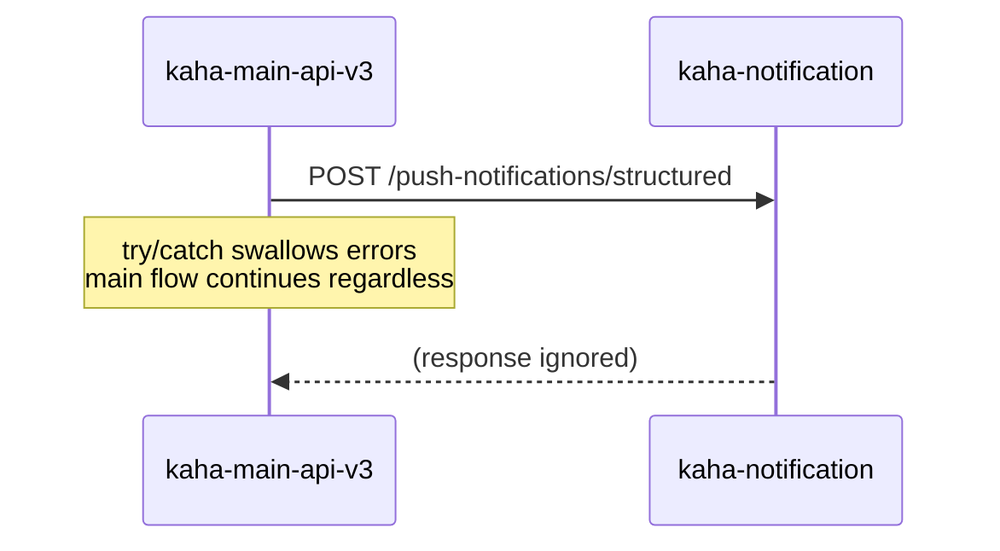
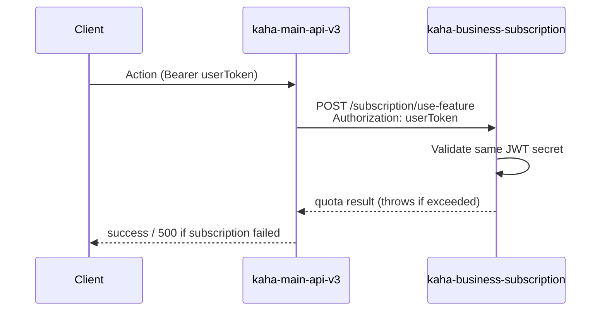
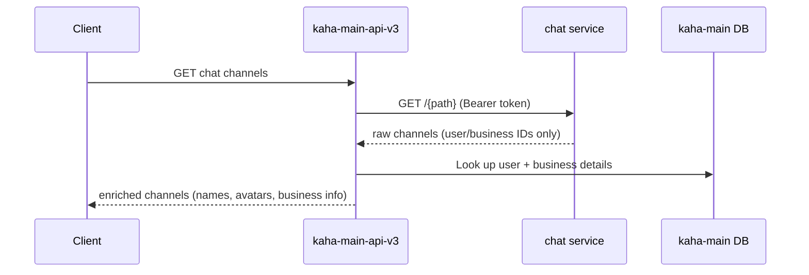
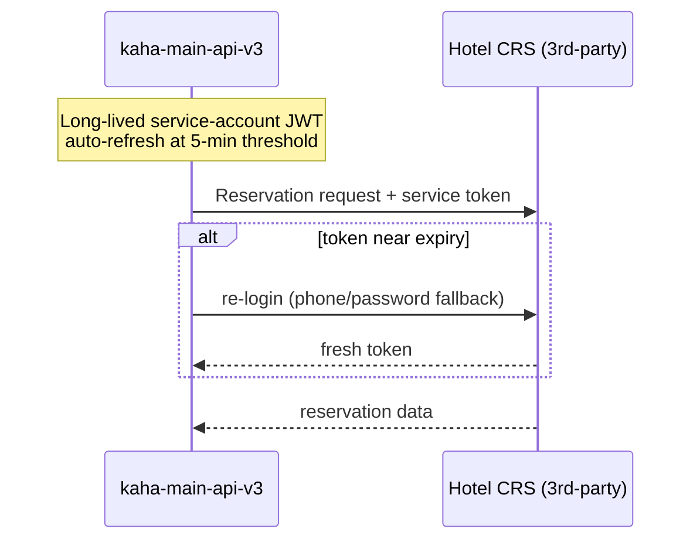
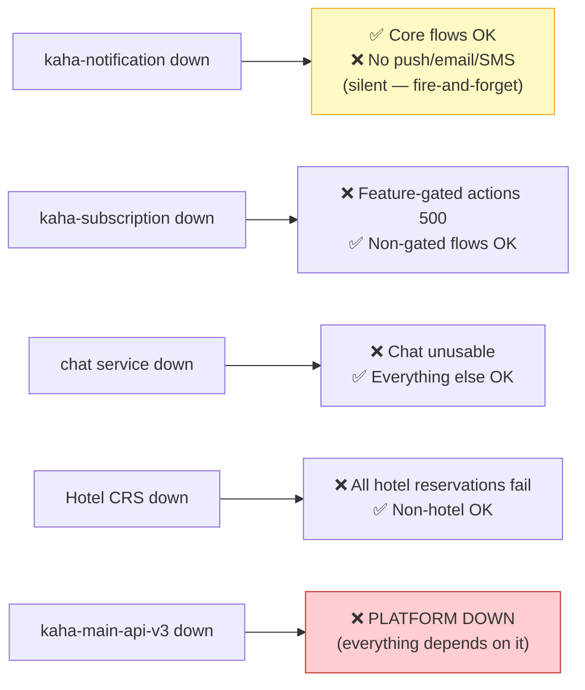

# Kaha Platform — Service Architecture & Integration

> **Read this first.** Every other project doc assumes you understand this page.
> This describes *how the services connect* and *why they were designed this way*.

---

## 1. The Big Picture

Kaha is a **central backbone + satellite microservices** architecture. One service (`kaha-main-api-v3`) owns identity and business data. Every other service either calls the backbone or is called by it. No service shares a database with another.

**Reading the diagram:** arrows point in the direction of the HTTP call. `kaha-main-api-v3` is the hub — it calls 6 systems outward, and is called inward by `restaurant-ecommerce` (and the hotel/hostel backends for auth).

---

## 2. Every Integration, Explained

Each row is a real, code-verified HTTP integration. Env var names are exact.

| Caller | Callee | Env Var | What it does | Pattern |
|---|---|---|---|---|
| `kaha-main-api-v3` | `kaha-notification` | `NOTIFICATION_URL` | Push, email, SMS, topic subs, device tokens | Fire-and-forget |
| `kaha-main-api-v3` | `kaha-business-subscription` | `SUBSCRIPTION_URL` | Subscribe business, use-feature quota, tiers | Sync + token forward |
| `kaha-main-api-v3` | chat service | `CHAT_URL` | Fetch chat channels, then enrich with user/business data | Proxy + enrich |
| `kaha-main-api-v3` | Hotel CRS | `CRS_BASE_URL` | Hotel search/book/cancel reservation proxy | Service account |
| `kaha-main-api-v3` | EV API | `EV_API_URL` | Filter EV charging points | Sync passthrough |
| `kaha-main-api-v3` | Hostel API | `HOSTEL_API_URL` | Hostel-related business lookups | Sync passthrough |
| `restaurant-ecommerce` | `kaha-main-api-v3` | `KAH_API_V3_BASE_URL` | Get user, business, business-user role | Sync (validate-on-use) |
| `hms-api` (hotel) | `kaha-main-api-v3` | (kaha-sync module) | Service-account sync of property/booking | Service account |
| `hostel-server` | `kaha-main-api-v3` | `KAHA_MAIN_API_URL` | User auth validation | Stateless JWT |

---

## 3. The Four Integration Patterns (and why each was chosen)

The codebase uses **four distinct patterns**. Knowing which is which tells you how failures behave.

### Pattern A — Fire-and-forget (notifications)

**Decision:** Notification calls are wrapped in `try/catch` that logs but never throws. On logout, `deleteNotificationDevice` even has a 5s timeout and explicitly does *not* rethrow.
**Why:** A notification failure must never break a user action. If FCM is down, login should still succeed. Reliability of the core flow > delivery guarantee of a push.
**Consequence for maintainers:** Lost notifications are *silent*. Don't debug "missing push" by looking at the main API logs — look at the notification service + BullMQ queue.

### Pattern B — Sync with token forwarding (subscription)

**Decision:** The user's *own* `Authorization` token is forwarded to the subscription service. The subscription service validates it independently using the **same `JWT_SECRET_TOKEN`**.
**Why:** Subscription decisions are per-user/per-business and must be authorized as that user. Forwarding the token avoids a second auth handshake and keeps the subscription service stateless.
**Consequence:** All services **must** share the identical `JWT_SECRET_TOKEN`. Rotating it is a coordinated, all-services deploy — not a single-service change.

### Pattern C — Proxy + enrich (chat)

**Decision:** The chat service stores only IDs. `kaha-main-api-v3` fetches raw channels then hydrates them from its own `UserRepository` / `BusinessRepository`.
**Why:** Chat shouldn't duplicate user/business data (single source of truth stays in the backbone). The trade-off is N+1 lookups, mitigated with `Promise.all`.
**Consequence:** Chat is unusable without the backbone — it has no display data on its own.

### Pattern D — Service account (Hotel CRS)

**Decision:** CRS is a *3rd-party* system. The backbone authenticates as a single service account (not per-user), with token auto-refresh (`CRS_TOKEN_REFRESH_THRESHOLD_MS=300000`) and a 30s request timeout.
**Why:** The CRS doesn't know about Kaha users. One machine identity proxies all hotel traffic.
**Consequence:** CRS outages affect all hotel reservations platform-wide. The 30s timeout is the blast-radius limiter.

---

## 4. Cross-Cutting Architectural Decisions

These decisions hold across **all** services. They're the load-bearing rules — changing one is a platform-wide event.

| Decision | Rationale | What breaks if ignored |
|---|---|---|
| **Database-per-service, no shared DB** | Independent deploy + schema evolution. Each service owns its data. | Cross-service `JOIN`s are impossible by design — use HTTP calls or ID references |
| **Cross-service refs are string IDs, not FKs** | DBs are physically separate; FKs can't span them | No referential integrity across services — validate via HTTP at write time (see ecommerce) |
| **Shared `JWT_SECRET_TOKEN`, stateless auth** | Any service validates a token alone — no central session store, no auth round-trip | Mismatched secret = every cross-service call 401s. Rotation = coordinated deploy |
| **Snapshot financial/historical data** | E.g. ecommerce orders copy menu/price at order time | Upstream edit/delete would silently corrupt order history |
| **PostGIS on backbone + notification** | Geofencing, proximity search, geo-hash device targeting | Plain `postgres` image fails migrations — must use `postgis/postgis` |
| **NestJS everywhere** | One framework, one mental model across 6+ backends | Onboarding cost stays low; patterns are copy-paste portable |

---

## 5. Failure Behavior Cheat-Sheet

When something breaks, this tells you the blast radius:

**The backbone is the single point of failure by design.** That's the trade-off of this architecture: simplicity and one source of truth, at the cost of `kaha-main-api-v3` being mission-critical. Any HA/scaling effort should prioritize it first.

---

## 6. Where To Go Next

- Backbone internals → [`kaha-main-api/overview.md`](kaha-main-api/overview.md)
- Notification service → [`kaha-notification/overview.md`](kaha-notification/overview.md)
- Subscription service → [`kaha-subscription/overview.md`](kaha-subscription/overview.md)
- E-commerce service → [`kaha-ecommerce/overview.md`](kaha-ecommerce/overview.md)
